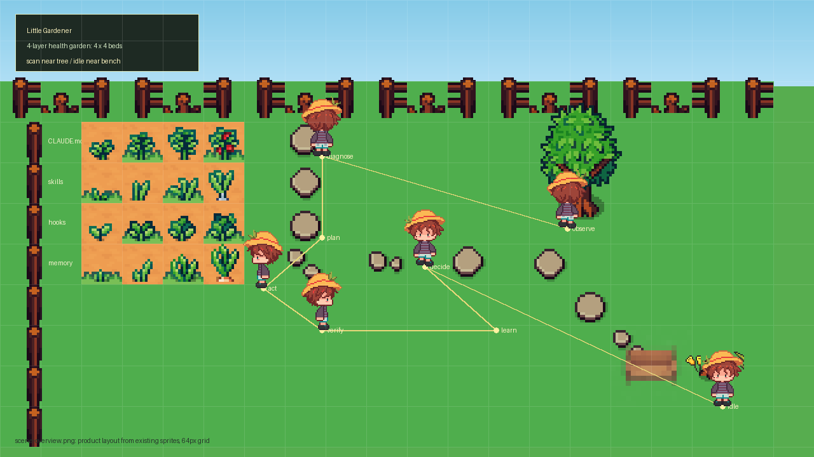

```
   ╻ ╻┏━┓╻  ╻ ╻┏━┓┏━┓┏━╸┏━┓┏━┓╻┏━┓
   ┃ ┃┣━┛┃  ┃ ┃┣━┛┣━┫┣╸ ┣━┫┗━┓┃┣━┛
   ┗━┛╹  ┗━╸┗━┛╹  ╹ ╹┗━╸╹ ╹┗━┛╹╹

   ╺━━━━━━━━━━━━━━━━━━━━━━━━━━━━━━━━━━━━━━╸
   你的项目是一座花园，让一个可爱的小园丁帮你照料它
   ╺━━━━━━━━━━━━━━━━━━━━━━━━━━━━━━━━━━━━━━╸
```

<p align="center">
  
  
  
  
  
</p>

<br>

<p align="center">
  
  <br>
  <em>一个在花园里忙碌的小园丁——你的项目上下文健康吗？</em>
</p>

---

## 🌱 什么是 Little Gardener？

你有没有过这种感觉——

项目的 `CLAUDE.md` 三个月没碰了，里面写的约定早就不对。`.claude/memory/` 下躺着七八个文件，没人知道哪些还管用。每次开新会话，Agent 不认识仓库里的规则，你得重新说一遍。

**这不是你的问题。** 上下文文件会腐烂，就像花园会长杂草。

<br>

> **Little Gardener** 是一个 AI Agent skill。它每天（或按你设定的节奏）在你的项目里巡逻一圈，检查这些上下文文件的健康状况，顺便修剪一下枯枝败叶。

<br>

> 而且它有一个可爱的 2D 像素花园——**你看一眼就知道项目干不干净。**

---

## 🔄 它怎么工作

整个系统跑在一个叫 **Loop Engineering** 的循环上。不用管这个术语是什么意思——你只需要知道它会自己转：

```
你输入 /gardener
       ↓
  🔍  园艺师走进花园，巡视每棵植物（=每个文件）
  🩺  蹲下来检查：枯萎了？长杂草了？藤蔓缠一起了？
  📋  想一下怎么剪
  🔧 （经你同意后）开剪
  ✅  退后一步，看看剪得怎么样
  📝  记下来：这棵植物的习性
  🔁  决定：继续巡逻，还是歇会儿？
```

每个步骤都对应 Pygame 花园里园艺师的一个动作。你在看动画的时候，就知道 Loop 跑到哪了。

---

## 🎮 花园界面预览

```
┌────────────────────────────────────────────────────┐
│  🌱 Little Gardener                      [⚙]     │
│  健康度: 78/100 ████████████████░░░░░             │
│  问题: 3 个                                        │
│                                                    │
│   🌻 CLAUDE.md    🌿 memory/       🥀 rules/     │
│   (92分)          (75分)           (45分)         │
│                                                    │
│        🧑‍🌾 → 正在修剪枯萎的植物                    │
│                                                    │
│  [⏸ 按 SPACE 进入待机]                             │
└────────────────────────────────────────────────────┘
```

右边栏的 ⚙ 面板里，你可以改任何规则：

- 「45 天不更新才算枯萎」→ 改阈值
- 「矛盾检测太吵了，关掉」→ 关开关
- 「发现问题直接修，不用问我」→ 改策略
- 「每周一早上 9 点自动巡逻」→ 设定时

---

## 🚀 装一下

```bash
git clone https://github.com/dotVSdoll/little-gardener.git
```

然后打开项目。一个可爱的 hook 会自动帮你装好 pygame，你不用敲第二行命令。

## 🎯 用一下

```bash
# Claude Code
/gardener "检查项目上下文文件健康度"

# 想要更深入
/gardener "修剪花园" --apply
```

Agent 会跑完整个 Loop，然后啪地弹出 Pygame 窗口——**你看到花园的时候，就知道你的项目干净不干净了。**

---

## 🏗️ 技术栈

| 层 | 技术 | 为什么 |
|----|------|--------|
| 可视化 | Pygame | Python 最成熟的 2D 引擎，跨平台 |
| 引擎 | Python 3.11+ | 统一技术栈，JSON 原生支持 |
| 美术 | 像素风 (PNG) | itch.io 素材包，现有资源驱动场景 |

## 📁 项目结构

```
little-gardener/
├── src/              # Python 源码（引擎 + 游戏）
├── sprites/          # 像素美术资源
├── skills/           # Skill 定义
├── summary/          # 项目上下文
└── docs/             # 文档 & 概念图
```

详细架构见 [docs/architecture.md](docs/architecture.md)。

---

## 🧭 项目哲学

### 这不是一个工具，这是一个园丁

大部分代码工具是「一次性」的——你运行它，它输出结果，完事了。

Gardener 不是。它每次运行都是一次完整的 Loop Engineering 循环：

- 它记得上次修剪了什么（`.gardener-memory.json`）
- 它会自我改进（Learn 阶段）
- 它可以定时自己跑（调度面板）
- 它做任何修改前都会问你（Safety 优先）

### 像素风不是装饰

花园不是仪表盘。**花园是一个隐喻。** 你不需要读报告——你看一眼植物的状态就知道项目健不健康。🌻 很好，🌿 还行，🥀 该管管了。直觉理解，零学习成本。

---

## 🗺️ 路线图

- [x] **v0.1** — 扫描器 + 分析器 + 静态报告
- [x] **v0.2** — Pygame 花园窗口 + 规则面板
- [ ] **v0.3** — 完整像素美术 + 多平台支持
- [ ] **v0.4** — 常驻 Web 服务 + 实时调度

---

## 🎨 场景概览

`docs/scene-overview.png` 由 `web/public/sprites/` 中的现有 PNG 资源生成，
用于替代旧的外部概念图。它同时展示主花园排布、角色巡逻路径、植物状态、
地块/道路/围栏/装饰物，以及右侧素材覆盖面板。

### 理想视觉参考

<p align="center">
  
</p>

这张图表达长期目标：更完整的像素花园、更有层次的 HUD、更清晰的 Loop 阶段可视化，以及更丰富的场景装饰。当前 Web Canvas 版本先保持轻量测试场景：主花床、树、长椅、围栏、角色状态和规则面板优先，不强行加入石块等复杂地表排布。

实现原则：

- 场景坐标保持稳定，浏览器中按较小比例居中显示。
- 正式界面不显示调试路线，角色移动路线由内部 waypoint 驱动。
- 规则设置先聚焦定时任务和停止策略，skill 装配留到后续设计。

---

## 📜 License

MIT © [dotVSdoll](https://github.com/dotVSdoll)

---

<p align="center">
  <code>让你的上下文花园保持茂盛 🌻</code>
</p>
