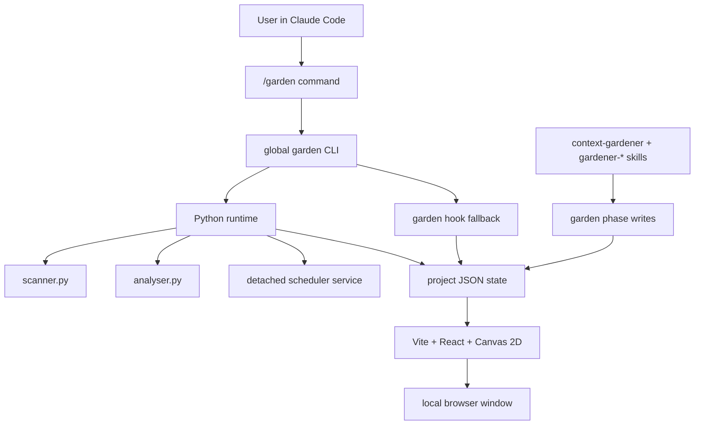
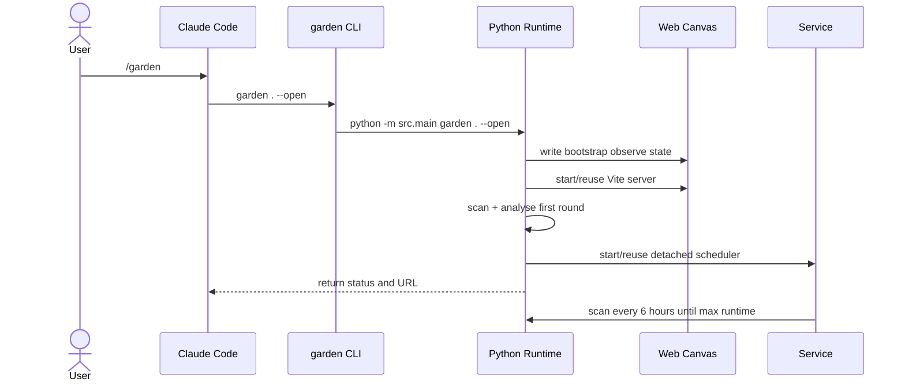
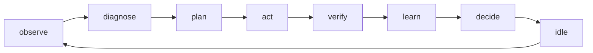

# Architecture

Little Gardener is split into a Claude integration layer, a Python runtime, and
a Web Canvas visualizer.



## Runtime Flow



## State Files

```text
.gardener-state.json       latest visual and health state
.gardener-memory.json      durable loop memory
.gardener-service.json     background service status
.gardener-runs/            immutable round snapshots
.gardener-config.json      user thresholds, schedule, skill mapping
```

## Phase Mapping



Explicit phase writes are preferred:

```bash
garden phase . observe
garden phase . diagnose --layer hooks
garden phase . idle
```

Hooks only infer phases when no recent explicit phase write exists.
