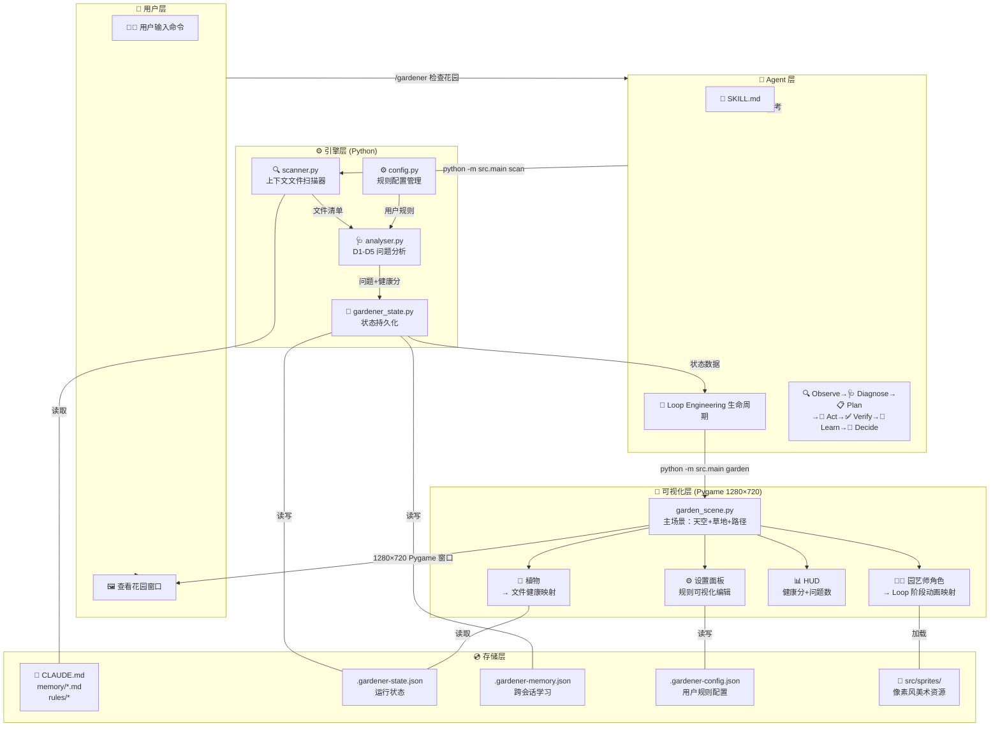
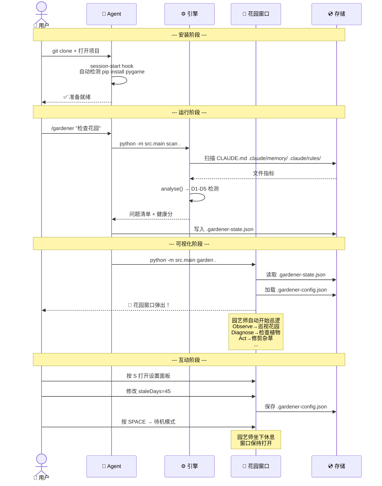
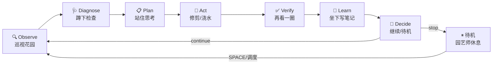

# Little Gardener — 项目架构

> 以下架构图使用 Mermaid 语法，在 GitHub 上会自动渲染。

## 系统架构总览



## 用户全旅程



## Loop 与动画映射



## 目录结构

```
little-gardener/
├── .claude/
│   ├── commands/gardener.toml     # /gardener 命令
│   └── hooks/
│       ├── session-start.sh       # 自动安装依赖
│       └── hooks.json             # 钩子注册
├── skills/context-gardener/
│   ├── SKILL.md                   # Loop Engineering 定义
├── src/                           # Python 源码
│   ├── main.py                    # 入口
│   ├── scanner.py                 # 文件扫描
│   ├── analyser.py                # 问题分析
│   ├── gardener_state.py          # 状态管理
│   ├── config.py                  # 规则配置
│   └── game/
│       ├── garden_scene.py        # Pygame 主场景
│       ├── character.py           # 园艺师角色
│       ├── plants.py              # 植物渲染
│       └── hud.py                 # HUD+设置面板
├── sprites/                       # 像素美术资源
│   ├── gardener/                  # 园艺师动画帧
│   ├── plants/                    # 植物精灵
│   └── tiles/                     # 场景图块
├── summary/                       # 上下文关键信息
├── docs/philosophy.md
├── CLAUDE.md                      # 项目开发指令
├── README.md                      # 项目叙事
└── pyproject.toml
```
